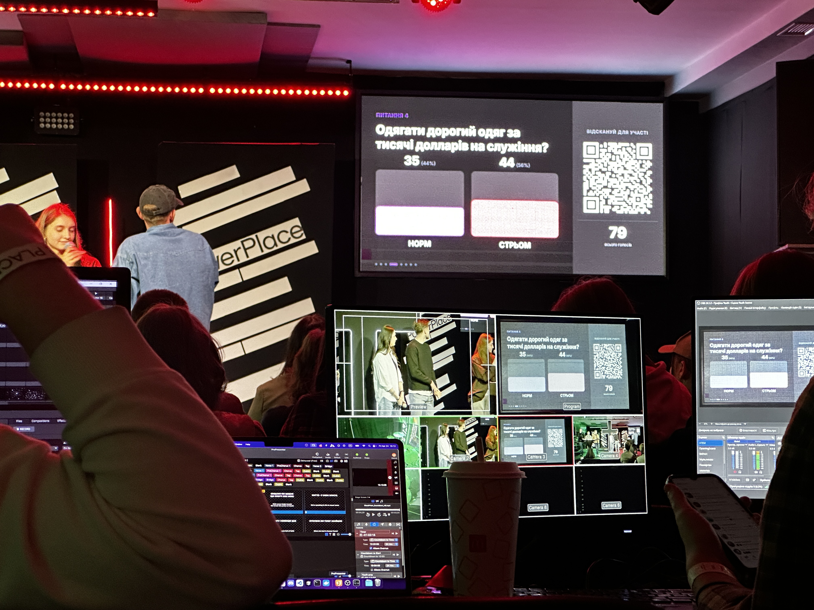
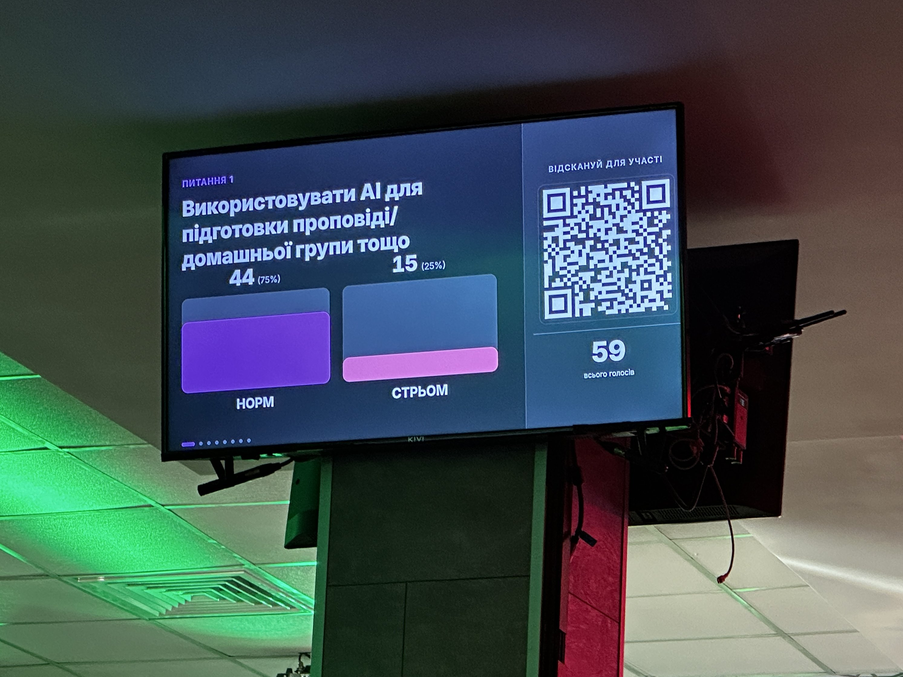
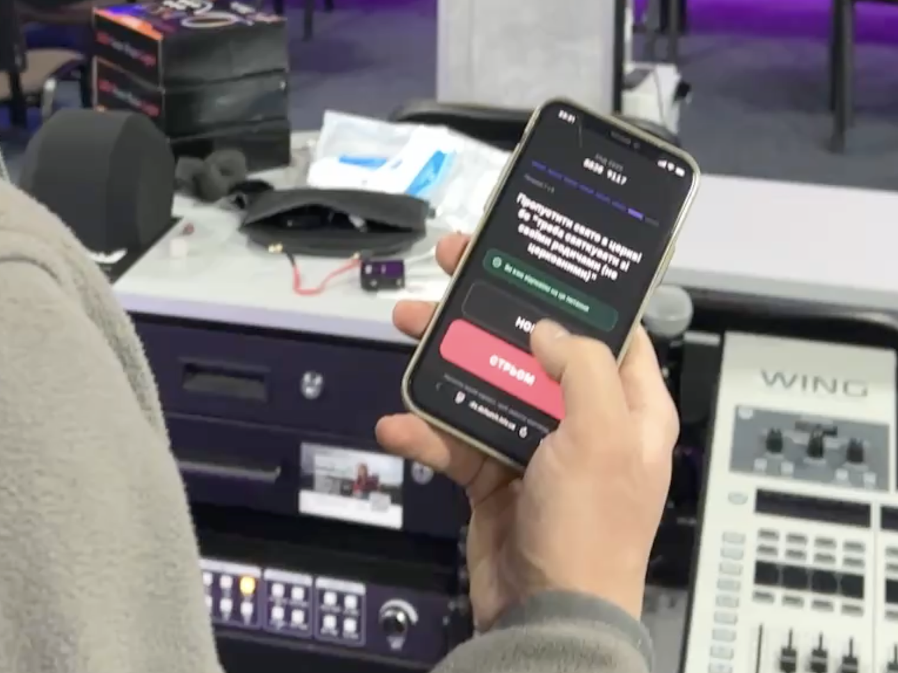
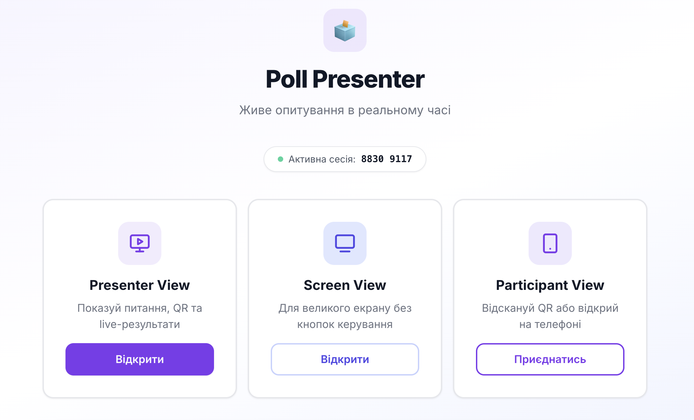
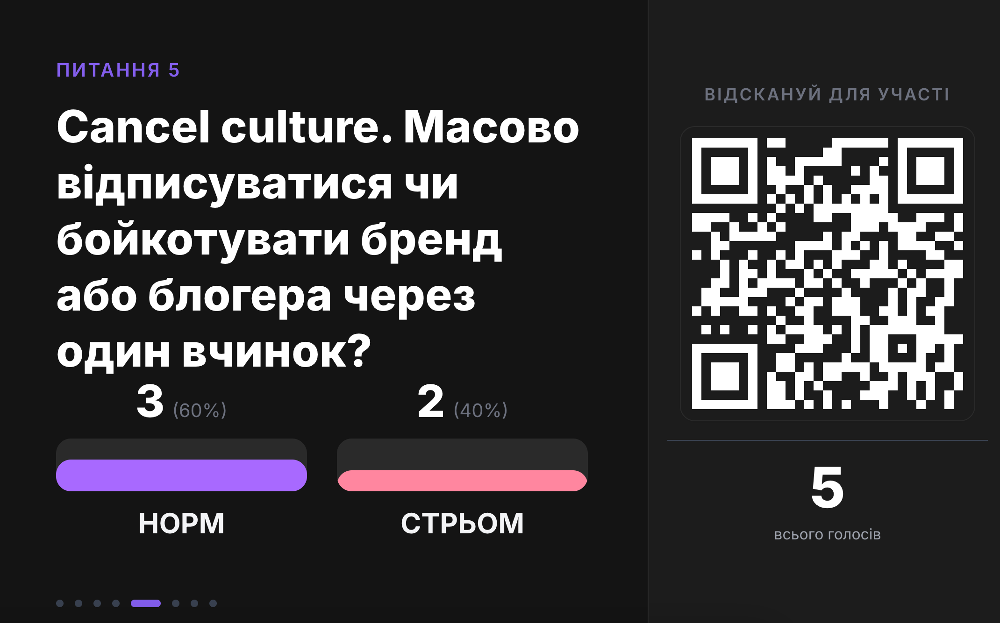
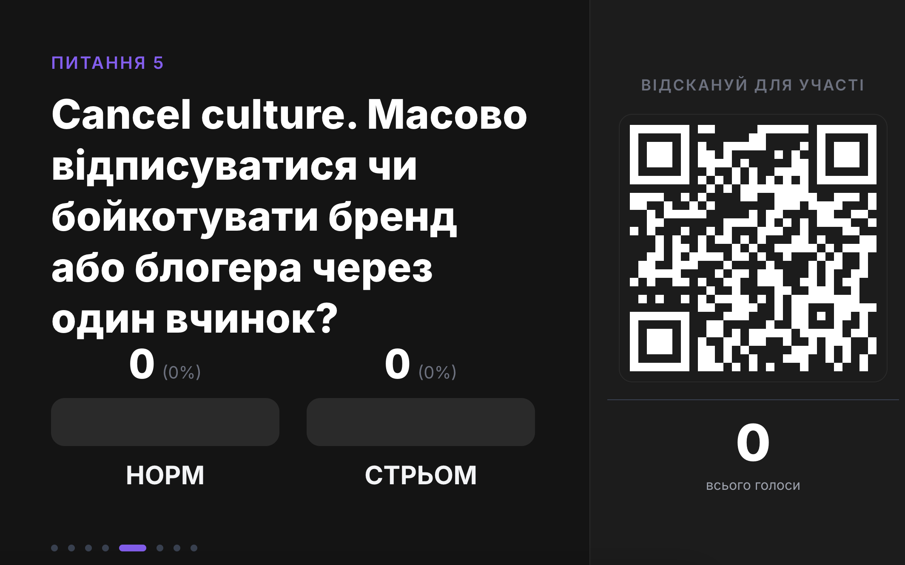
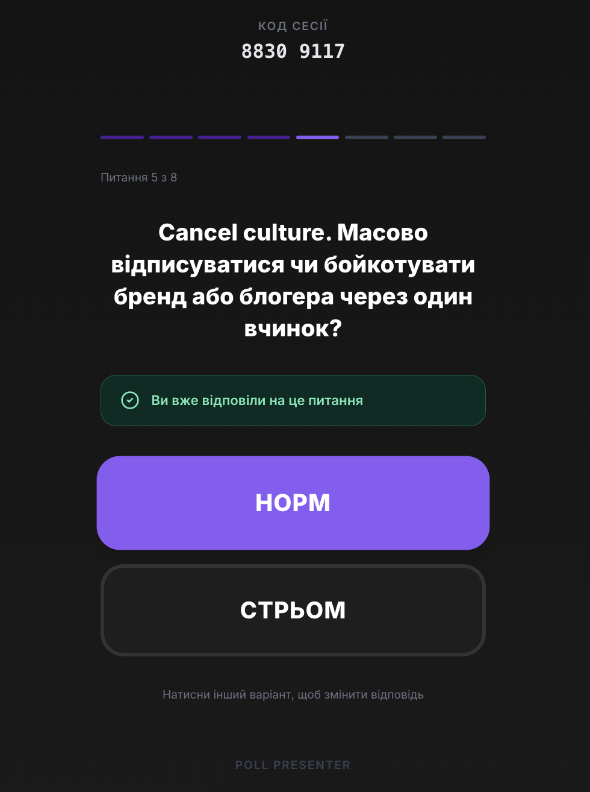

# Poll Presenter

A real-time live polling app for in-person events — speaker has a control screen, the audience joins from their phones via QR code, and a third "stage" view projects the question + live bar chart on the big screen behind the speaker.

### Battle-tested at a real event

The app has already been used live at a conference of **~150 attendees** voting concurrently on 8 questions in a single session. No outages, no degraded performance, votes streamed in under 100ms end-to-end. It's ready to be reused at the next event.

<p align="center">
  
</p>
<p align="center">
  
  
</p>

> **Status:** MVP. Single hardcoded session, in-memory state, no persistence, no auth. Intentionally so — see [Design choices](#design-choices).

## The app

Three views, one session.

### Home

Landing page with three entry points — Presenter, Screen, Participant. All three share the same hardcoded session code (`88309117`).

<p align="center">
  
</p>

### Presenter view (`/present/:code`)

The speaker's control panel — runs on the speaker's laptop. Shows the current question, a QR code so the audience can join, live vote count, and controls for:

- Navigating questions (next / prev / direct jump via dots)
- Two-step "next": first click reveals results, second click moves on
- Light/dark theme toggle (broadcasts to everyone)
- Reset session (clears all votes, rotates `subSession` so participant phones drop their local "voted" state)

<p align="center">
  
</p>

### Screen view (`/screen/:code`)

Read-only stage display — runs on the projector. No controls, no chrome. Just question + image, then bar chart when results are revealed. QR code reappears alongside the chart so latecomers can still join.

<p align="center">
  
</p>

### Participant view (`/join/:code`)

Mobile-first. Big tap targets, two-option buttons (НОРМ / СТРЬОМ in the original session — fully customizable). A participant who already voted sees a "you voted" banner and can switch their answer (a single "revote" operation, see [Revote](#why-revote-exists)).

Vote state is stored in `localStorage` keyed by `voted:<sessionCode>:<questionId>`, so refreshing the page doesn't let you double-vote. The server rotates a `subSession` UUID on reset — when participants see it changed, they clear their local state.

<p align="center">
  
</p>

## Tech stack

| Layer | Choice | Why |
|---|---|---|
| Backend framework | **NestJS 10** | Batteries-included; DI + decorators give clean module boundaries even for a tiny app. |
| HTTP adapter | Express (`@nestjs/platform-express`) | Standard, lets us mount static asset middleware easily. |
| WebSocket | **socket.io** via `@nestjs/platform-socket.io` | Auto-reconnect, room support, polling-fallback for flaky mobile networks. |
| Frontend framework | **React 18** | Pages stay simple — no SSR needed since the SPA is served as static assets in prod. |
| Bundler / dev server | **Vite 5** | Instant HMR, proxies `/api` + `/socket.io` to Nest in dev. |
| Styling | **Tailwind CSS** + **shadcn/ui** (Button, Card primitives) | Utility classes scale; shadcn gives accessible primitives without runtime UI lib bloat. |
| Routing | `react-router-dom` v6 | 4 routes, no nesting. |
| Realtime client | `socket.io-client` | Pairs with the gateway. |
| QR | `react-qr-code` | Pure SVG, no canvas. |
| Icons | `lucide-react` | Tree-shakeable. |
| Shared types | **TypeScript** in `shared/types.ts` | Imported by both backend (relative) and frontend (`@shared/*` alias) — single source of truth for payloads. |
| Config | `@nestjs/config` with `.env` | `PORT`, `CORS_ORIGINS`. |
| Process manager (prod) | `pm2` | Wired into `npm run prod`. |
| Node | ≥ 18 (`.nvmrc` pins exact version) | |

**No database. No auth. No ORM.** State lives in memory in `SessionService` and resets on process restart — see [Design choices](#design-choices).

## Architecture

```
┌─────────────────────────────────────────────────────────────────┐
│                        Browser clients                          │
│  ┌──────────────┐    ┌──────────────┐    ┌──────────────────┐   │
│  │  Presenter   │    │    Screen    │    │   Participant    │   │
│  │  (laptop)    │    │  (projector) │    │   (phone × N)    │   │
│  └──────┬───────┘    └──────┬───────┘    └────────┬─────────┘   │
└─────────┼───────────────────┼─────────────────────┼─────────────┘
          │                   │                     │
          │ REST (writes)     │                     │ REST (votes)
          │ + WS subscribe    │ WS subscribe        │ + WS subscribe
          ▼                   ▼                     ▼
┌─────────────────────────────────────────────────────────────────┐
│                       NestJS server :3000                       │
│                                                                 │
│   ┌────────────────────────┐    ┌────────────────────────────┐  │
│   │  SessionController     │    │      SessionGateway        │  │
│   │  (REST /api/session/*) │───▶│  (socket.io, room per code)│  │
│   └──────────┬─────────────┘    └─────────────┬──────────────┘  │
│              │                                │                 │
│              └────────────┬───────────────────┘                 │
│                           ▼                                     │
│                ┌──────────────────────┐                         │
│                │   SessionService     │                         │
│                │   (in-memory state)  │                         │
│                │ • activeQuestionId   │                         │
│                │ • votes Map<k,n>     │                         │
│                │ • theme              │                         │
│                │ • resultsVisible     │                         │
│                │ • subSession (UUID)  │                         │
│                └──────────────────────┘                         │
│                                                                 │
│   Static: /images/*  ← src/session/images/                      │
│   Static: SPA fallback → build/index.html                       │
└─────────────────────────────────────────────────────────────────┘
```

### The REST + WS pattern

Writes go over **REST**, broadcasts come back over **WebSocket**. Same pattern Slack, Linear, Trello use.

**Why both:**
- REST is request/response. The client that performed the action gets a direct HTTP response with success/error. Easy to debug with curl/DevTools, easy to add auth/middleware later.
- WS is one-way push. The server needs to tell *all other clients in the room* that something changed. Polling would burn battery on 150 phones; WS lets the server push only when there's news.

**Flow for a vote:**

1. Participant taps НОРМ → `POST /api/session/88309117/vote { optionId: "norm" }`.
2. `SessionController.castVote` calls `SessionService.castVote` — increments `Map<"q5:norm", n>`.
3. Controller then calls `SessionGateway.broadcastResults` — emits `RESULTS_UPDATED` to room `session:88309117`.
4. Every client in that room (presenter, screen, all other participants) receives the new counts and re-renders the chart.
5. The voting participant *also* receives the new counts as the REST response — used as a fast-path UI update without waiting for the round-trip through WS.

### Session rooms

Every WS client emits `join_session { sessionCode }` after connecting. The gateway puts them in a socket.io room `session:<code>`. All broadcasts target that room, so adding more sessions in the future is just "more rooms" — no code changes needed.

### `subSession` — how participants detect a reset

The server holds a `subSession` UUID that rotates on `POST /reset`. Participants store the last-seen value in `localStorage`. When the server broadcasts `SESSION_RESET` with a new UUID, clients see the mismatch and clear their per-question vote records — so post-reset they can vote again from scratch.

### Why `revote` exists

`vote` only increments. It has no concept of "who you are" because there's no auth. If a participant who picked НОРМ wanted to switch to СТРЬОМ via a second `vote` call, both counts would go up — one person, two votes counted.

`revote` is atomic "−1 from old option, +1 to new option, broadcast once" — keeps totals honest. The frontend remembers the user's previous selection in `localStorage` and sends `{ fromOptionId, toOptionId }`.

### Dev vs prod serving

- **Dev** — two processes: Nest on `:3000`, Vite on `:5173`. Vite's dev server proxies `/api` and `/socket.io` to Nest (`web/vite.config.ts`). Open `http://localhost:5173`.
- **Prod** — one process. Vite builds the SPA to `build/`, tsc compiles Nest to `dist/`. Nest serves both: API at `/api/*`, WS at `/socket.io/*`, static images at `/images/*`, and falls back to `build/index.html` for everything else (so `/present/88309117` resolves to the SPA, which then handles routing client-side). Open `http://localhost:3000`.

## API

All routes are prefixed with `/api`. Payload shapes live in [`shared/types.ts`](shared/types.ts).

| Method | Path | Body | Purpose |
|---|---|---|---|
| `GET` | `/session/:code` | — | Full session snapshot |
| `GET` | `/session/:code/results` | — | Vote counts for the active question |
| `POST` | `/session/:code/vote` | `{ optionId }` | Increment a count; broadcast `RESULTS_UPDATED` |
| `POST` | `/session/:code/revote` | `{ fromOptionId, toOptionId }` | Move one vote between options |
| `POST` | `/session/:code/question` | `{ questionId }` | Switch active question; broadcast `QUESTION_CHANGED` |
| `POST` | `/session/:code/reveal` | — | Reveal results; broadcast `RESULTS_REVEALED` |
| `POST` | `/session/:code/theme` | `{ theme: 'light' \| 'dark' }` | Switch theme; broadcast `THEME_CHANGED` |
| `POST` | `/session/:code/reset` | — | Clear votes, rotate `subSession`, broadcast `SESSION_RESET` |

## WebSocket events

| Event | Direction | Payload |
|---|---|---|
| `join_session` | client → server | `{ sessionCode }` |
| `results_updated` | server → room | `SessionResults` |
| `question_changed` | server → room | `{ session, results }` |
| `results_revealed` | server → room | `{ session }` |
| `theme_changed` | server → room | `{ session }` |
| `session_reset` | server → room | `{ session, results }` |

All event names are exported as `WS_EVENTS` from `shared/types.ts`.

## Project layout

```
poll-presenter/
├── src/                              NestJS backend
│   ├── main.ts                       bootstrap, CORS, static assets, SPA fallback
│   ├── app.module.ts
│   ├── app.controller.ts             catch-all → build/index.html
│   └── session/
│       ├── session.module.ts
│       ├── session.service.ts        in-memory state + business logic
│       ├── session.controller.ts     REST endpoints
│       ├── session.gateway.ts        socket.io gateway
│       ├── constants.ts              SESSION_CODE, QUESTIONS, options
│       └── images/q1..q8.webp        served at /images/*
│
├── web/                              React + Vite frontend
│   ├── index.html
│   ├── vite.config.ts                proxies /api and /socket.io to :3000
│   ├── tailwind.config.js
│   ├── postcss.config.js
│   └── src/
│       ├── main.tsx                  router setup (4 routes)
│       ├── index.css                 Tailwind base + globals
│       ├── lib/
│       │   ├── api.ts                fetch wrapper for REST
│       │   ├── socket.ts             single shared socket.io-client + event subs
│       │   ├── useSessionTheme.ts    applies light/dark class on <html>
│       │   └── utils.ts              cn() — tailwind-merge helper
│       ├── components/ui/            shadcn primitives (Button, Card, …)
│       └── pages/
│           ├── HomePage.tsx
│           ├── PresenterPage.tsx
│           ├── ScreenPage.tsx
│           └── ParticipantPage.tsx
│
├── shared/
│   └── types.ts                      Session, Results, Payloads, WS_EVENTS
│
├── docs/                             screenshots + conference photos
├── build/                            Vite output (generated)
├── dist/                             tsc output (generated)
├── .env / .env.example               PORT, CORS_ORIGINS
├── package.json                      single root package
├── tsconfig.json                     backend
└── nest-cli.json
```

## Requirements

- Node.js **≥ 18** (`.nvmrc` pins the exact recommended version)
- npm

```bash
nvm install   # picks the version from .nvmrc
nvm use
```

## Setup & run

```bash
npm install
```

### Dev

```bash
npm run dev
```

Runs Nest (`:3000`, watch mode) and Vite (`:5173`, HMR) in parallel via `concurrently`. **Open `http://localhost:5173`** — Vite proxies API + WebSocket to Nest.

### Production

```bash
npm run build   # vite build → build/, then tsc → dist/
npm start       # node dist/src/main — single process on :3000
```

Or under pm2:

```bash
npm run prod
```

Then open `http://localhost:3000`.

## Environment

Copy `.env.example` to `.env`:

```ini
PORT=3000
CORS_ORIGINS=http://localhost:5173,http://localhost:3000
```

Both are required — Nest fails to boot otherwise (`getOrThrow`). `CORS_ORIGINS` is applied to both the Express CORS middleware and the socket.io engine's `allowRequest` check.

## Session config

The single session (code `88309117`), its 8 questions, and option labels live in [`src/session/constants.ts`](src/session/constants.ts). To add or change questions, edit that file — `npm run dev` picks it up via watch mode.

```typescript
{
  id: 'q9',
  text: 'New question?',
  options: [
    { id: 'yes', label: 'YES' },
    { id: 'no',  label: 'NO'  },
  ],
  image: '/images/q9.webp',
},
```

Each question has its own `options` array — they don't have to be the same across questions.

## Design choices

This is an MVP. The constraints are deliberate:

- **In-memory state.** Restart = blank slate. There's no DB, no Redis, nothing to back up. For a single-event app that runs for 90 minutes, persistence is just risk.
- **One hardcoded session code.** No "create session" flow, no DB of sessions. The code is a string in `constants.ts`. Sharing the QR is enough.
- **No auth.** Anyone with the QR can vote. The audience self-polices — this is a conference room, not the internet. The frontend keeps a `localStorage` flag to prevent the same browser from double-voting per question, but a determined user could clear it. We accept that.
- **No vote-per-user tracking.** The server only knows totals per option. This is why `revote` exists as a separate atomic operation — see [Why revote exists](#why-revote-exists).
- **Hardcoded questions.** No CMS, no admin UI for content. Editing means a code change + redeploy. For a one-event app, this is faster than building a question editor.

If you wanted to grow this beyond MVP — multi-session, persistence, auth, an admin UI — the boundaries are already in place (`SessionService` is the only thing that touches state, `SessionGateway` is the only thing that broadcasts, `shared/types.ts` is the contract). You'd swap the in-memory `Map` for a DB and add a session-creation flow on top, without rewiring the rest.

## License

[MIT](LICENSE) © Yurii Khvishchuk
